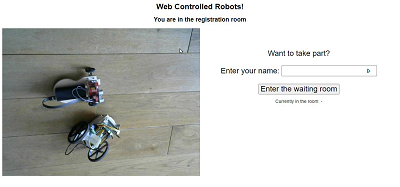
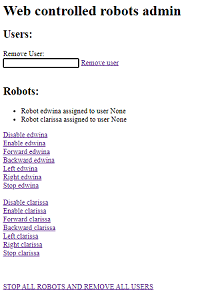

# Web Controlled Robots (Full Version)

These are brief notes and are not intended to be a full tutorial.  A simpler version of this code is explained in detail here:

https://www.thinkcreatelearn.co.uk/resources/web-controlled-robot.html

The project contains 2 directories.  

The **web-server** directory contains the main web application.  Install this on your main computer in a directory called web-server.  Your main computer could be a Windows PC or Mac or Linux or Raspberry Pi.  You can attach a camera to it (a standard webcam or a Raspberry Pi camera for the Raspberry Pi) if you want to stream a view of the robot room.

The **robot** directory contains the code for the robot.  Install this on each Raspberry Pi robot you want to control in a directory called robot.  The mqtt_robot.py version is for "standard" Raspberry Pi robots, and uses the gpiozero Robot class.  The mqtt_picon_robot.py version is a version for use with the Picon Zero motor controller.

## Web server setup

Follow the setup instructions here to install Mosquitto and Paho:

https://www.thinkcreatelearn.co.uk/resources/web-controlled-robot.html

Edit the settings in **web_site_settings.py**.

Find the following lines in the Global objects section of the code:

<pre>
robots = {"petra":None, "betty":None}

# List of cameras
cameras = {"Main":"/video", "Rear":"http://petra:5001/video"}
</pre>

Enter the name of your robots and the URL of your additional cameras.  Leave the main camera as-is.  Note that when you test this locally and connected to the internet the URLs will be different.  

In web_site.py you can change between a standard webcam 

<pre>from webcam_player import VideoPlayer</pre>

and a Raspberry Pi Camera:

<pre>from pi_camera_player import VideoPlayer</pre>

Start the web application by running:

> python3 web_site.py

Then from a browser you can browse to the main page:

> http://localhost:5000/

---

---

To get the admin screen:

http://localhost:5000/admin

---

---

## Additional camera setup

You can install additional cameras, on different machines around the room.  On each computer running additional cameras, run:

> python3 streamvideo.py

or, you can run the simpler version on Raspberry Pi's with a Raspberry Pi camera (this version doesn't need OpenCV):

> python3 streamsimple.py

The URL for the camera needs to be added to the cameras dictionary in web_site_settings.py.

Note that you can alter the code to rotate the camera, change the resolution, etc.

## Robot setup

On each robot, edit mqtt_robot.py or mqtt_picon_robot.py.  Find these lines:

<pre>
MQTT_BROKER = "web-server"              # Change to name of your broker 
MQTT_TOPIC = "robots/clarissa"          # Change to name of your topic
</pre>

Change the name "web-server" to the name or IP address of your web server.

Change the name "clarissa" to the name of this robot.

Start the robot:

> python3 mqtt_robot.py

or 

> python3 mqtt_picon_robot.py

## Run a camera on the robot

### On the robot:
Run streamvideo.py on the robot.
Change the camera config if required in pi_camera_player.py.

Note that to reduce bandwidth use, use the lowest quality settings on the robot camera.  These are fine:

<pre>
RESOLUTION = (160,120)
JPEGQUALITY = 10
FPS = 5
</pre>

### On the main website:
Add the camera to the cameras dictionary in web_site_settings.py.

## Exposing your server on the internet

The best way to do this is to set up a DMZ or port forwarding on your router.  Otherwise you could use a service like ngrok.

## Setting up a service on the robot
The easiest way to manage the robot is to set up a service that starts when the robot starts.

Create  **/usr/bin/runrobot.sh** and add the following

<pre>
DATE=`date '+%Y-%m-%d %H:%M:%S'`
echo "Myservice service started at ${DATE}" | systemd-cat -p info

python3 /home/pi/web-controlled-robot-full/robot/mqtt_picon_robot.py &
python3 /home/pi/web-controlled-robot-full/web-server/streamvideo.py
</pre>

> sudo chmod +x /usr/bin/runrobot.sh

Create **/etc/systemd/system/runrobot.service** and add the following:

<pre>
[Unit]
Description=Web robot systemd service.

[Service]
Type=simple
User=pi
ExecStart=/bin/bash /usr/bin/runrobot.sh

[Install]
WantedBy=multi-user.target
</pre>

Create  **/etc/systemd/system/runrobot.timer** and add the following:

<pre>
[Unit]
Description=Load network drive with delay

[Timer]
OnBootSec=1min

[Install]
WantedBy=timers.target
</pre>

Enable the timer:

> sudo systemctl enable myservice.timer

Reboot the Pi.

